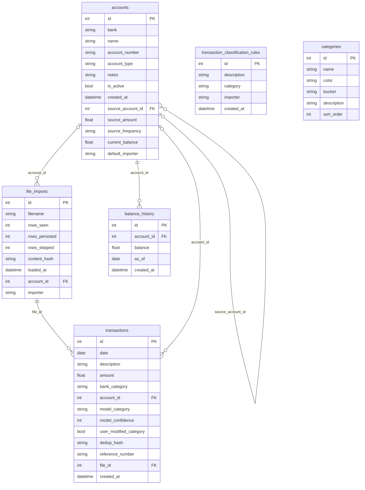

# Faresight — Local Expense Tracker

A self-hosted expense tracker that stores transactions in a local SQLite database,
with a FastAPI backend and a plain HTML/JS/Chart.js frontend.

## Stack

| Layer    | Technology                                                          |
|----------|---------------------------------------------------------------------|
| Backend  | Python · FastAPI · SQLAlchemy 2                                     |
| Database | SQLite (local file, WAL mode)                                       |
| Frontend | Bootstrap 5.3 · Vanilla JS · Chart.js 4 · Tabulator 6 · FA Free 6 |

## Project layout

```
faresight/
├── app/
│   ├── faresight.py       # FastAPI app wiring — routers, lifespan, HTML routes
│   ├── database.py        # SQLAlchemy engine + migrate_db()
│   ├── models.py          # ORM models: Transaction, Account, FileImport, Rule
│   ├── schemas.py         # Pydantic request/response schemas
│   ├── config.py          # Reads config.yaml into typed constants
│   ├── sync.py            # NAS sync state machine (startup pull, periodic push, lock file)
│   ├── categorizer.py     # Background AI categorization worker (Ollama)
│   ├── routers/
│   │   ├── transactions.py  # /api/transactions, /api/summary/*
│   │   ├── categories.py   # /api/categories (CRUD)
│   │   ├── insights.py     # /api/insights/* (recurring, trends, merchants)
│   │   ├── accounts.py      # /api/accounts, /api/accounts/bank-logos
│   │   ├── rules.py         # /api/rules (classification rules CRUD + apply)
│   │   └── sync.py          # /api/sync, /api/sync/status, /api/sync/go-offline
│   └── importers/
│       ├── __init__.py      # IMPORTERS registry
│       └── *.py             # One module per bank format
├── frontend/
│   ├── assets/
│   │   ├── css/app.css
│   │   ├── scripts/
│   │   │   ├── common.js    # Shared: API helper, NAS banners, category colours, rule modals
│   │   │   ├── app.js       # Dashboard: transactions table, charts
│   │   │   └── upload.js    # Upload page: dropzone, importer select, rules table
│   │   └── templates/partials/   # Jinja2 partials (modals shared across pages)
│   └── app/pages/
│       ├── index.html       # Dashboard (transactions + charts)
│       ├── accounts.html    # Account management
│       └── upload.html      # CSV upload + classification rules
├── tests/
├── config.yaml
└── requirements.txt
```

## Frontend libraries

All loaded via jsDelivr CDN — no local copies.

| Library | Version |
|---|---|
| Bootstrap | 5.3.3 |
| Font Awesome Free | 6.7.2 |
| Chart.js | 4 |
| Tabulator | 6.3.0 |

## Quick start

```bash
python -m venv .venv

# Activate — pick the line that matches your shell:
source .venv/bin/activate           # bash / zsh
source .venv/bin/activate.fish      # fish
.venv\Scripts\activate              # Windows cmd/PowerShell

pip install -r requirements.txt
```

Then start the dev server (works from bash, fish, zsh, or any shell):

```bash
./dev.sh          # start in background
./dev.sh stop     # stop
./dev.sh status   # check if running
```

Open http://localhost:8000 in your browser. Logs are written to `.dev.log`.

## Dev server script (`dev.sh`)

`dev.sh` manages the uvicorn process as a background daemon and tracks it with a `.dev.pid`
file. It calls `.venv/bin/uvicorn` directly, so no shell activation is needed — the script
works identically from bash, fish, zsh, or any other shell.

| Command | Action |
|---------|--------|
| `./dev.sh` or `./dev.sh start` | Start uvicorn in the background |
| `./dev.sh stop` | Send SIGTERM to the server |
| `./dev.sh status` | Show running / stopped / stale-pidfile |

**After editing `config.yaml`** (e.g. adding banks), a full restart is required — `--reload` only watches `.py` files:

```bash
./dev.sh stop && ./dev.sh start
```

## Configuration (`config.yaml`)

| Key                    | Default                                       | Description                         |
|------------------------|-----------------------------------------------|-------------------------------------|
| `local_db_path`        | `~/.local/share/expense-tracker/local.db`     | Path to the local SQLite database   |
| `nas_share_path`       | `/mnt/nas-expenses/expenses.db`               | NAS path (used by future sync step) |
| `sync_on_startup`      | `true`                                        | Pull from NAS on startup (TODO)     |
| `sync_on_shutdown`     | `true`                                        | Push to NAS on shutdown (TODO)      |
| `sync_interval_minutes`| `5`                                           | Background sync cadence (TODO)      |

The local DB directory is created automatically on first run.

## API

| Method | Path                          | Description                    |
|--------|-------------------------------|--------------------------------|
| GET    | `/api/transactions`           | List all (paginated)            |
| POST   | `/api/transactions`           | Create a transaction            |
| GET    | `/api/transactions/{id}`      | Get one transaction             |
| PATCH  | `/api/transactions/{id}`      | Update fields                   |
| DELETE | `/api/transactions/{id}`      | Delete                          |
| GET    | `/api/summary/by-month`       | Totals grouped by year+month (`?bucket=income\|spend`) |
| GET    | `/api/summary/cashflow`       | Monthly income/spend/net series |
| GET    | `/api/summary/badges`         | Net worth + monthly flow + savings rate |
| GET    | `/api/insights/recurring`     | Detected recurring charges + price changes |
| GET    | `/api/insights/category-trends` | MoM spend deltas + trailing 3-mo averages |
| GET    | `/api/insights/top-merchants` | Spend grouped by merchant       |
| GET    | `/api/categories`             | All categories (CRUD managed)   |
| POST   | `/api/categories`             | Create a category               |
| PATCH  | `/api/categories/{name}`      | Update color/bucket/description |
| DELETE | `/api/categories/{name}`      | Delete a category               |

Interactive docs at http://localhost:8000/docs.

## Transaction fields

| Field                   | Type     | Required | Notes                                        |
|-------------------------|----------|----------|----------------------------------------------|
| `date`                  | date     | yes      | YYYY-MM-DD                                   |
| `description`           | string   | yes      |                                              |
| `amount`                | float    | yes      | Negative = expense, positive = income        |
| `bank_category`         | string   | no       | Raw bank label; LLM hint only, never displayed |
| `account_id`            | int      | no       | FK → accounts                                |
| `model_category`        | string   | no       | Canonical display category; pinned once user-edited |
| `model_confidence`      | int      | no       | 0–10; null = pending AI; 10 = rule/user-assigned |
| `user_modified_category`| bool     | no       | True once the user has manually set a category |
| `category` (POST only)  | string   | no       | Manual-entry human choice → becomes `model_category`, pinned |

## Running tests

```bash
pytest tests/ -v
```

Tests use an in-memory SQLite database — the real local DB is never touched.

| File | Covers |
|------|--------|
| `tests/conftest.py` | Fixtures: in-memory DB, `TestClient`, `make_tx` helper |
| `tests/test_transactions.py` | CRUD: create, read, list, filter, patch, delete |
| `tests/test_summary.py` | `/api/summary/by-model-category`, `/api/summary/by-month`, `/api/categories` |
| `tests/test_config.py` | Config loading and type correctness |
| `tests/test_nas.py` | NAS stub raises `NotImplementedError` |

## NAS sync

On startup the app calls `sync_from_nas()` (in `app/sync.py`) before serving any requests.
It expects the Samba share to already be mounted — it will not try to mount it.

| Situation | Action |
|-----------|--------|
| NAS dir unreachable | Warn and continue offline — a yellow banner appears in the UI |
| NAS reachable, no DB file yet | Push local DB up to NAS (first-run bootstrap) |
| NAS file newer than last pull | Backup `local.db` → `local.db.bak`, pull NAS copy down |
| Local already current | Skip |

A `.synced_at` marker file (stored alongside `local_db_path`) records the mtime of the NAS
file at the time of the last sync. This is how "newer" is determined.

The sync status is exposed at `GET /api/sync/status` and shown as a banner in the UI
when the NAS is unreachable or when a fresh pull happened.

## Sync lifecycle

| Trigger | Action |
|---------|--------|
| App startup | Pull from NAS (if newer), write lock file |
| Every `sync_interval_minutes` | Push local → NAS via background asyncio loop |
| App shutdown (SIGINT/SIGTERM) | Final push, release lock file |
| "Sync now" button | POST `/api/sync` → immediate push |

Lock file (`<nas_share_path>.lock`) contains `{hostname, timestamp}`. If another
machine's lock is fresher than `sync_interval_minutes`, the UI shows:

> "Database may be in use on \<hostname\>. Proceeding will sync your local copy
> and may overwrite their recent changes."

[Proceed anyway] pushes and claims the lock. [Work offline] disables NAS sync
for the session.

## Database schema



## Roadmap

- [ ] Date-range filtering on the transactions endpoint
